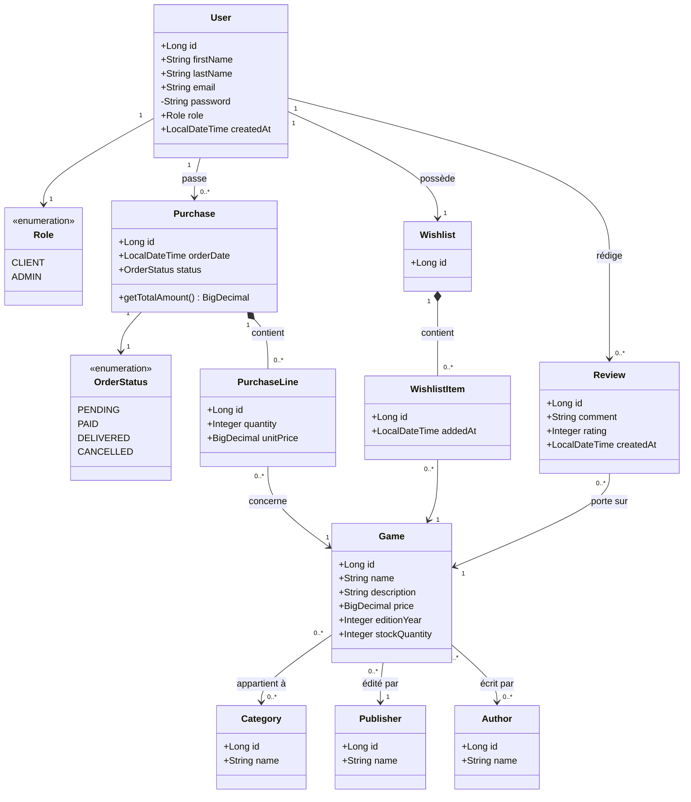

# Étape 2 — Modèle relationnel et entités

Objectif : reprendre les classes `model` du stagiaire, corriger les incohérences via une démarche Merise (MCD → MLD → modèle objet JPA), et documenter le résultat en diagramme de classes.

## 1. Modèle Conceptuel de Données (MCD)

### Entités et attributs

- **UTILISATEUR** : id, prénom, nom, email, mot de passe, rôle, date de création
- **JEU** : id, nom, description, prix, année d'édition, quantité en stock
- **CATEGORIE** : id, nom
- **EDITEUR** : id, nom
- **AUTEUR** : id, nom
- **COMMANDE** : id, date de commande, statut
- **LIGNE_COMMANDE** : id, quantité, prix unitaire
- **AVIS** : id, commentaire, note, date
- **WISHLIST** : id (une par utilisateur)
- **LIGNE_WISHLIST** : id, date d'ajout

### Associations et cardinalités

| Association | Cardinalités | Commentaire |
|---|---|---|
| JEU — APPARTIENT — CATEGORIE | (0,n) — (0,n) | un jeu peut appartenir à plusieurs catégories (ex. « stratégie » et « ambiance »), une catégorie regroupe plusieurs jeux → association porteuse `JEU_CATEGORIE` |
| JEU — EDITE_PAR — EDITEUR | (0,n) — (1,1) | un jeu a un éditeur, un éditeur publie plusieurs jeux |
| JEU — ECRIT_PAR — AUTEUR | (0,n) — (0,n) | plusieurs auteurs par jeu, plusieurs jeux par auteur → association porteuse `JEU_AUTEUR` |
| UTILISATEUR — PASSE — COMMANDE | (1,1) — (0,n) | une commande appartient à un seul utilisateur |
| COMMANDE — CONTIENT — LIGNE_COMMANDE | (1,1) — (0,n) | une commande a plusieurs lignes |
| LIGNE_COMMANDE — CONCERNE — JEU | (0,n) — (1,1) | une ligne porte sur un seul jeu |
| UTILISATEUR — REDIGE — AVIS | (1,1) — (0,n) | un avis appartient à un seul utilisateur |
| AVIS — PORTE_SUR — JEU | (0,n) — (1,1) | un avis porte sur un seul jeu |
| UTILISATEUR — POSSEDE — WISHLIST | (1,1) — (1,1) | un utilisateur a exactement une liste de souhaits |
| WISHLIST — CONTIENT — LIGNE_WISHLIST | (1,1) — (0,n) | une wishlist contient plusieurs lignes (mêmes principes que COMMANDE/LIGNE_COMMANDE) |
| LIGNE_WISHLIST — CONCERNE — JEU | (0,n) — (1,1) | un même jeu peut être présent dans les lignes de wishlist de plusieurs utilisateurs différents, mais une seule fois par wishlist |

## 2. Modèle Logique de Données (MLD)

```
UTILISATEUR (id, prenom, nom, email, mot_de_passe, role, date_creation)
CATEGORIE (id, nom)
EDITEUR (id, nom)
AUTEUR (id, nom)
JEU (id, nom, description, prix, annee_edition, quantite_stock, #editeur_id)
JEU_CATEGORIE (#jeu_id, #categorie_id)
JEU_AUTEUR (#jeu_id, #auteur_id)
COMMANDE (id, date_commande, statut, #utilisateur_id)
LIGNE_COMMANDE (id, quantite, prix_unitaire, #commande_id, #jeu_id)
AVIS (id, commentaire, note, date_avis, #utilisateur_id, #jeu_id)
WISHLIST (id, #utilisateur_id) -- unique(utilisateur_id)
LIGNE_WISHLIST (id, date_ajout, #wishlist_id, #jeu_id) -- unique(wishlist_id, jeu_id)
```

## 3. Diagramme de classes (modèle objet / JPA)



## 4. Corrections apportées par rapport au code du stagiaire

| Problème initial | Correction | Justification |
|---|---|---|
| Aucune annotation JPA sur les modèles, alors que `spring-boot-starter-data-jpa` est déclaré | Ajout de `@Entity`, `@Id`, `@GeneratedValue`, `@ManyToOne`, `@OneToMany`, `@ManyToMany` | Permet réellement d'utiliser Hibernate comme demandé, au lieu du JDBC brut du contrôleur |
| `Game.auteur` en `String` alors qu'une entité `Author` existe | `Game` référence désormais `Set<Author>` via une table d'association `game_author` | Un jeu peut avoir plusieurs auteurs (cas fréquent en jeu de société) ; élimine la redondance/incohérence de données |
| `Game.genre` (String) et `Game.category` (objet) redondants | Un seul champ `categories` (`@ManyToMany`, table `game_category`), remplaçant l'ancien `category` unique (`@ManyToOne`) | Une seule source de vérité pour la/les catégorie(s) d'un jeu (normalisation) ; un jeu de société entre fréquemment dans plusieurs catégories (ex. « stratégie » et « famille »), une relation 1-n était trop restrictive |
| `Inventory` = `HashMap<Game, Integer>` en attribut d'objet, non persistable par Hibernate | Supprimé ; le stock devient l'attribut `Game.stockQuantity` | Pas de besoin métier de suivre plusieurs entrepôts ; une table séparée aurait été une sur-ingénierie |
| `Purchase` sans lien vers l'utilisateur qui commande | Ajout de `Purchase.user` (`@ManyToOne`) | Une commande doit obligatoirement être rattachée à un client |
| `Purchase` avec 3 booléens (`paid`, `delivered`, `archived`) | Remplacés par un unique enum `OrderStatus` (`PENDING`, `PAID`, `DELIVERED`, `CANCELLED`) | Ces états sont mutuellement exclusifs ; des booléens indépendants permettent des combinaisons incohérentes (ex : `archived=true` et `paid=false`) |
| `PurchaseLine` sans quantité | Ajout de `quantity` et renommage de `prix` en `unitPrice` (prix figé au moment de l'achat) | Une ligne de commande doit pouvoir porter plusieurs exemplaires ; le prix doit être conservé même si le prix catalogue change ensuite |
| `Avis` sans lien vers l'utilisateur ni le jeu concerné | Renommé en `Review`, ajout de `user` et `game` (`@ManyToOne`) | Un avis n'a de sens que rattaché à un auteur et à un jeu |
| `Wishlist` : classe vide | Devient une entité `Wishlist` (une par utilisateur, `@OneToOne`) contenant des `WishlistItem` (`game`, `addedAt`), sur le même principe que `Purchase`/`PurchaseLine` | Un utilisateur ne possède qu'**une seule** liste de souhaits, qui référence plusieurs jeux ; un même jeu peut en revanche apparaître dans les wishlists de plusieurs utilisateurs différents. La première version confondait à tort « wishlist » et « ligne de wishlist » |
| `User` minimal (`id`, `nom`) | Ajout de `firstName`, `lastName`, `email`, `password`, `role`, `createdAt` | Nécessaire pour l'authentification (étape 3) et la distinction client/admin (étape 1) |
| Identifiants de type mêlé (`int` pour `Game`/`User`/`PurchaseLine`, `Long` pour `Author`) | Toutes les clés primaires standardisées en `Long` avec `GenerationType.IDENTITY` | Cohérence, compatible avec l'auto-incrément MySQL |
| Champs publics non encapsulés | Lombok (`@Getter`/`@Setter`/`@NoArgsConstructor`/`@AllArgsConstructor`/`@Builder`) | Encapsulation correcte, code concis, cohérent avec la dépendance Lombok déjà présente dans le `pom.xml` |
| Noms de classes en anglais mais attributs en français (mélange incohérent) | Uniformisation en anglais pour le code (convention Java/Spring), le français est conservé pour la documentation et le métier | Cohérence du code, lisible par toute l'équipe technique |

## 5. Impact sur l'existant

`GameController` (JDBC brut, identifiants MySQL en dur, référence aux anciens champs `nom`/`auteur`) a été supprimé : il est incompatible avec le nouveau modèle et de toute façon destiné à être remplacé par une architecture en couches (repository / service / contrôleur + DTOs), qui fait l'objet de la suite de l'étape 2.

Le projet compile (`./mvnw compile`) avec uniquement les classes du package `model` à ce stade.
