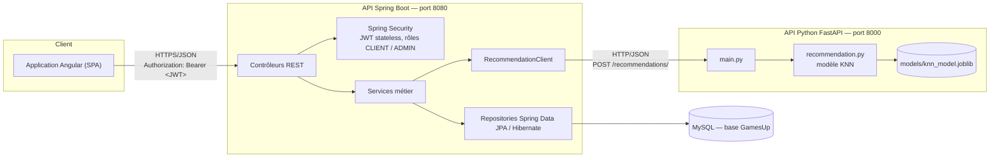
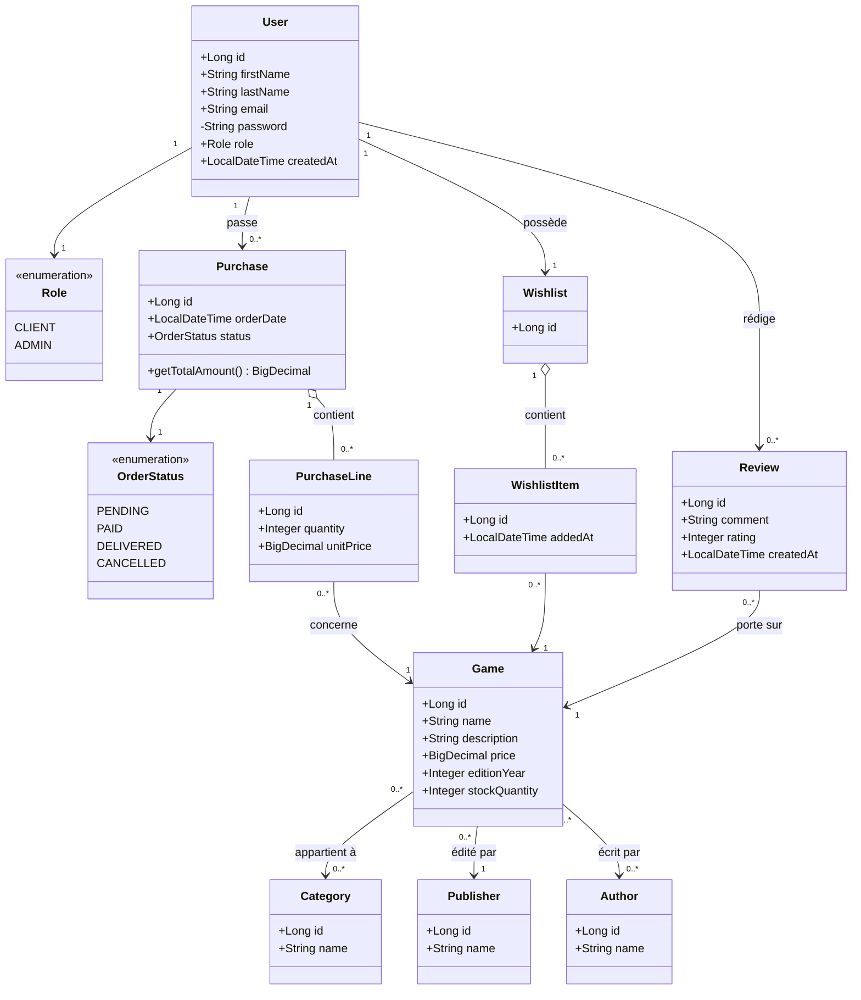
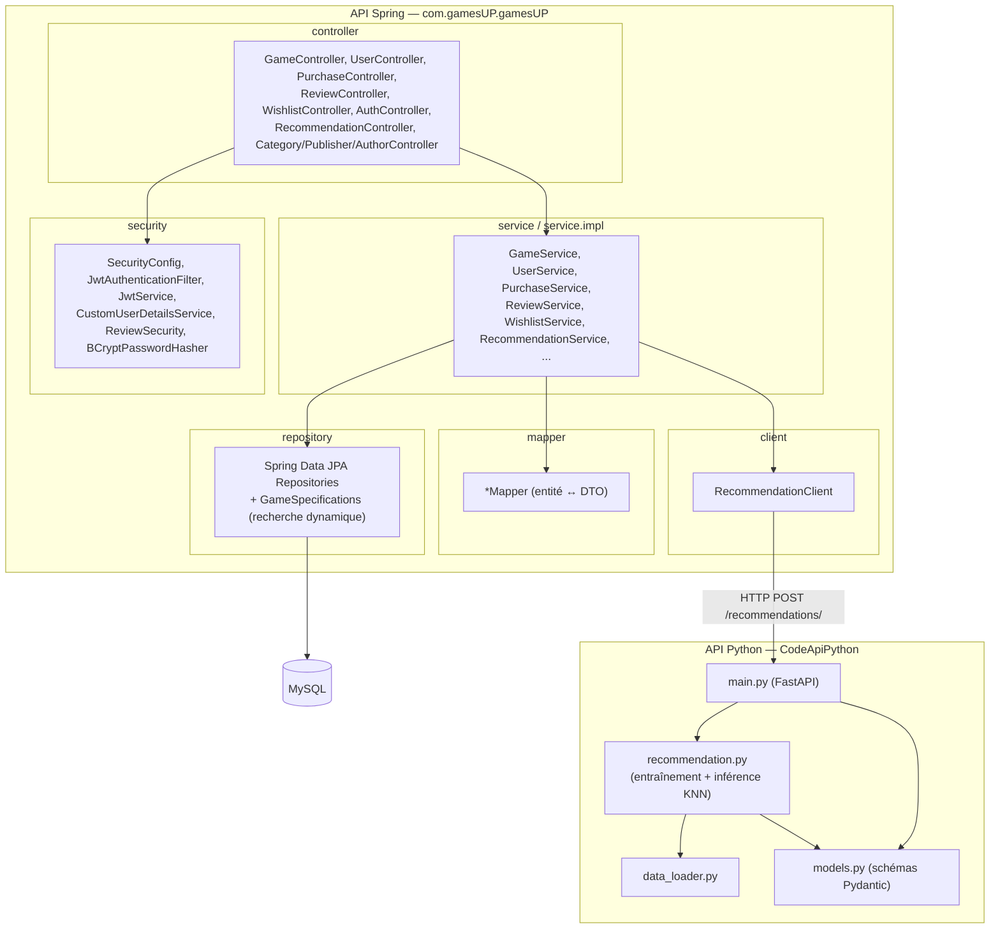
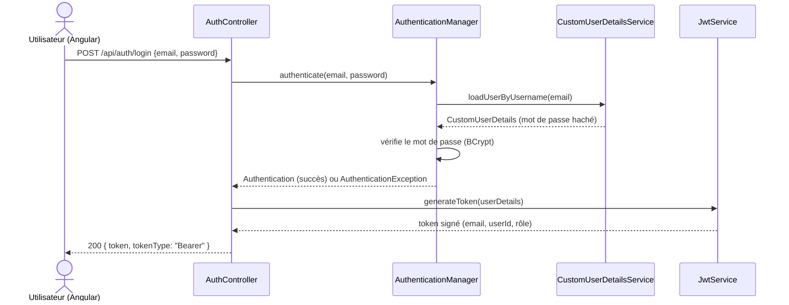
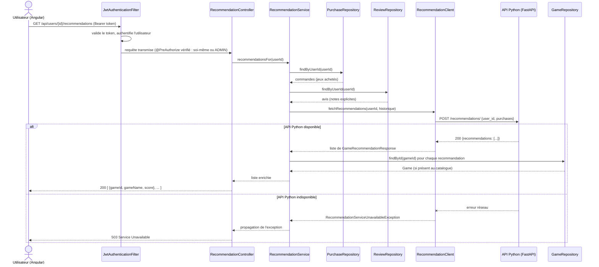

# Étape 5 — Documentation finale

Document de synthèse technique du projet GamesUP, destiné à l'équipe de développement. Il rassemble les diagrammes UML demandés, une explication des choix d'architecture et de leur conformité aux principes SOLID, le rapport de couverture de tests, une synthèse du travail sur le système de recommandation, et une réflexion sur la démarche de travail. Les étapes détaillées sont documentées séparément et restent la référence pour le détail : [01 — Fonctionnalités](../README.md), [02 — Modèle de données](02-modele-donnees.md), [03 — Architecture API](03-architecture-api.md), [04 — Sécurité et tests](04-securite-tests.md), [05 — Système de recommandation](05-systeme-recommandation.md).

## Sommaire

1. [Diagramme d'architecture](#1-diagramme-darchitecture)
2. [Diagramme de classes](#2-diagramme-de-classes)
3. [Diagramme de composants](#3-diagramme-de-composants)
4. [Diagrammes de séquence](#4-diagrammes-de-séquence)
5. [Principes SOLID et bonnes pratiques](#5-principes-solid-et-bonnes-pratiques)
6. [Rapport de couverture de tests](#6-rapport-de-couverture-de-tests)
7. [Système de recommandation](#7-système-de-recommandation)
8. [Réflexion : bonnes et mauvaises pratiques du projet](#8-réflexion--bonnes-et-mauvaises-pratiques-du-projet)

---

## 1. Diagramme d'architecture

Le système est constitué de trois briques indépendantes, communiquant exclusivement en HTTP/JSON : le front Angular (existant, non repris dans cette étude de cas), l'API Spring (cœur métier + persistance) et l'API Python (recommandation).

Points clés :
- Les trois briques sont déployables et scalables indépendamment (aucun couplage fort : l'API Spring reste fonctionnelle même si l'API Python est indisponible, hormis pour l'endpoint de recommandation, qui répond alors 503).
- Authentification stateless (JWT) : aucune session partagée à répliquer entre instances Spring.
- L'API Python ne connaît pas le schéma MySQL : elle ne reçoit que ce dont elle a besoin (identifiants et notes), transmis explicitement par l'API Spring.

## 2. Diagramme de classes

Modèle de données (entités JPA), issu de la démarche Merise détaillée dans [02 — Modèle de données](02-modele-donnees.md).

## 3. Diagramme de composants

## 4. Diagrammes de séquence

### 4.1 Authentification (login JWT)

### 4.2 Consultation des recommandations (flux complet Spring ↔ Python)

## 5. Principes SOLID et bonnes pratiques

Détail complet dans [03 — Architecture API](03-architecture-api.md#2-application-des-principes-solid) ; synthèse :

| Principe | Application concrète |
|---|---|
| **S** — Single Responsibility | Un contrôleur = mapping HTTP uniquement ; un service = logique métier d'un agrégat ; un mapper = conversion entité/DTO ; `GameSpecifications` isole la construction des critères de recherche |
| **O** — Open/Closed | `PasswordHasher` (interface) permet de passer d'une implémentation temporaire à `BCryptPasswordHasher` sans modifier `UserService` ; les critères de recherche de jeux s'ajoutent en combinant des `Specification<Game>` indépendantes sans toucher au repository |
| **L** — Liskov Substitution | Toutes les `*ServiceImpl` respectent strictement le contrat de leur interface, ce qui permet de les remplacer par des mocks dans les tests sans changer le code appelant |
| **I** — Interface Segregation | Une interface de service par agrégat (`GameService`, `UserService`, `RecommendationService`, ...) plutôt qu'une façade unique fourre-tout |
| **D** — Dependency Inversion | Contrôleurs → interfaces `service.*` (jamais les implémentations) ; `RecommendationService` → interface `RecommendationClient` (jamais `RestClient` directement) ; injection par constructeur (`@RequiredArgsConstructor`) |

Autres bonnes pratiques appliquées :
- **DTOs systématiques** (records Java) en entrée/sortie d'API : aucune entité JPA n'est jamais sérialisée directement (évite la sur-exposition, ex. mot de passe, et découple le contrat d'API du schéma de base).
- **Gestion d'erreurs centralisée** (`GlobalExceptionHandler`, `RestAuthenticationEntryPoint`, `RestAccessDeniedHandler`) : un seul format de réponse d'erreur (`ApiError`) pour toute l'API, y compris les erreurs d'authentification/autorisation.
- **Validation Bean Validation** (`@NotBlank`, `@Email`, `@Min`...) sur tous les DTOs de requête, plutôt que des vérifications manuelles dispersées dans les contrôleurs.
- **Transactions explicites** (`@Transactional`, `readOnly = true` sur les lectures) au niveau service, jamais au niveau repository ou contrôleur.
- **Autorisation déclarative** (`@PreAuthorize`) plutôt que des `if` de contrôle d'accès dispersés dans les contrôleurs.

## 6. Rapport de couverture de tests

Mesuré avec JaCoCo (`org.jacoco:jacoco-maven-plugin`) sur l'ensemble du module `gamesUP`, reproductible via `./mvnw clean test` puis ouverture de `ANNEXES/gamesUP/target/site/jacoco/index.html` (rapport HTML interactif, non versionné car généré).

**81 tests, 0 échec** (53 tests unitaires sur les 9 services avec Mockito, 27 tests d'intégration `MockMvc` + base H2 en mémoire couvrant l'authentification, les règles d'autorisation et les flux métier de bout en bout, 1 test de chargement de contexte).

| Portée | Instructions | Lignes | Branches |
|---|---|---|---|
| **Globale** | **85,2 %** | **85,9 %** | 76,8 % |
| Objectif demandé | 70 % | — | — |

Détail par package :

| Package | Couverture (instructions) | Commentaire |
|---|---|---|
| `mapper`, `model`, `dto.*` | 100 % | Classes simples (records, getters/setters), naturellement couvertes par les tests des couches supérieures |
| `security.jwt` | 97,7 % | Génération/validation de token testée via les flux d'authentification |
| `security` | 95,2 % | Filtre JWT, `UserDetailsService`, `ReviewSecurity` exercés par les tests d'intégration |
| `service.impl` | 89,4 % | Couche métier : cœur de la couverture unitaire |
| `exception` | 77,5 % | Gestion d'erreurs, exercée par les cas d'erreur des tests d'intégration |
| `controller` | 52,6 % | Voir limite ci-dessous |
| `repository.spec` | 42,5 % | Voir limite ci-dessous |
| `client` | 0 % | Voir limite ci-dessous |
| `com.gamesUP.gamesUP` (racine) | 37,5 % | Classe `GamesUpApplication` (point d'entrée, peu de logique testable) |

**Limites connues** (voir aussi §8) :
- `client` (`RecommendationClientImpl`) : jamais exercé directement, car systématiquement simulé (`@MockBean`) dans les tests — conformément à la consigne de ne pas tester l'API Python, mais cela laisse le code d'appel HTTP réel (sérialisation, gestion d'erreurs réseau) non couvert par un test automatisé.
- `repository.spec` (`GameSpecifications`) : certains critères de recherche (`hasAuthor`, `inStock`) ne sont pas exercés par les tests existants, leur logique équivalente étant déjà validée côté service pour les critères principaux.
- `controller` : les contrôleurs CRUD simples (catégories, éditeurs, auteurs) ne sont testés en HTTP que pour la création (utilisée comme donnée de préparation dans d'autres tests) ; leurs mises à jour/suppressions ne sont couvertes qu'au niveau service.

La couverture globale dépasse largement l'objectif de 70 % ; ces zones plus légèrement testées sont documentées ici pour rester transparent sur ce qui a été vérifié en profondeur et ce qui ne l'a été qu'indirectement.

## 7. Système de recommandation

Synthèse (détail complet : [05 — Système de recommandation](05-systeme-recommandation.md)) :

- **Données nécessaires identifiées** : une matrice utilisateur × jeu (note de 1 à 5), construite à partir des avis explicites (`Review.rating`) et, à défaut, d'une note implicite par défaut pour les jeux achetés mais non notés.
- **Algorithme implémenté** : KNN utilisateur-utilisateur (`sklearn.neighbors.NearestNeighbors`, similarité cosinus) côté API Python, avec une fonction d'entraînement (`train_model`, persistée via `joblib`) totalement indépendante et déjà fonctionnelle, bien qu'aucune donnée réelle ne soit encore disponible pour l'entraîner (le système retombe alors sur une liste de test, conformément à la consigne).
- **Communication Spring → Python** : `RecommendationService` reconstruit l'historique de l'utilisateur et appelle l'API Python via `RecommendationClient` (`RestClient`), avec traduction des erreurs réseau en réponse HTTP 503 cohérente avec le reste de l'API.
- **Tests** : uniquement côté Spring, l'API Python n'étant pas testée conformément à la consigne (`RecommendationClient` simulé dans les tests d'intégration).

## 8. Réflexion : bonnes et mauvaises pratiques du projet

### Ce qui a bien fonctionné

- **Corriger le modèle avant d'écrire l'API** : reprendre les entités du stagiaire selon une démarche Merise complète (MCD → MLD → JPA) avant d'écrire le moindre contrôleur a évité de construire des couches service/contrôleur sur des fondations incohérentes (le défaut principal du code repris).
- **Poser des abstractions avant d'en avoir besoin, mais seulement quand le besoin futur était déjà certain** : `PasswordHasher` a été introduit dès l'étape 2 (modèle de données) pour anticiper l'arrivée de Spring Security à l'étape 3, sans code jetable ni réécriture — un exemple concret du principe ouvert/fermé, appliqué parce que l'étape suivante était déjà connue (pas une anticipation spéculative).
- **Documentation tenue à jour à chaque étape** plutôt que rédigée entièrement à la fin : réduit le risque d'oubli ou d'incohérence entre le code et sa description, et a permis de indiquer les décisions de conception au moment où elles étaient prises (donc avec leur justification encore fraîche).
- **Tests écrits en continu**, avec mesure de couverture à chaque étape plutôt qu'un unique audit final — a permis de détecter immédiatement les régressions (ex. lors de la correction du modèle de Wishlist).

### Ce qui aurait pu être mieux fait

- **Une erreur de modélisation initiale sur la Wishlist** (confusion entre « la liste » et « une ligne de la liste ») n'a été repérée qu'après relecture par la suite, une fois le code déjà écrit et testé. Corrigée sans grande difficulté grâce aux tests déjà en place, mais elle aurait dû être détectée dès la conception du MCD, en confrontant systématiquement chaque association porteuse d'attribut à un exemple concret (« un utilisateur peut-il avoir plusieurs wishlists ? »).
- **Un défaut de configuration Maven est passé inaperçu pendant deux étapes complètes** : Maven Surefire n'incluait pas de façon fiable les classes de test `*IT` (ce rôle revient historiquement au plugin Failsafe, non utilisé ici), si bien qu'un même `mvn test` pouvait exécuter 58, 74 ou 81 tests selon les exécutions, sans qu'aucune erreur ne soit signalée. Cela signifie que les chiffres de couverture annoncés aux étapes 2 et 3 n'étaient pas garantis fiables a posteriori. Le défaut a été corrigé (inclusion explicite dans le `pom.xml`) dès sa découverte à l'étape 4, mais aurait dû être vérifié par une exécution répétée dès l'écriture de la première classe `*IT`, plutôt que d'être découvert plusieurs étapes plus tard.
- **Couverture de tests inégale** : certains contrôleurs CRUD simples et certains critères de recherche ne sont testés qu'indirectement (voir §6). La couverture globale dépasse l'objectif, mais cela ne garantit pas une couverture homogène de toute la base de code.
- **`RecommendationClientImpl` n'est jamais exercé par un test réel** : la consigne de ne pas tester l'API Python a été respectée en simulant systématiquement le client HTTP, mais cela laisse un angle mort : un problème de sérialisation ou de configuration réseau réel entre les deux API ne serait détecté qu'à l'exécution manuelle, qui n'a pas pu être effectuée dans cet environnement (Python n'y est pas installé).
- **Absence de pagination** sur les listes (`GET /api/games`, `/api/users`, `/api/purchases`...) : acceptable pour un jeu de données de démonstration, mais à corriger avant une mise en production avec un catalogue réel.
- **Le rôle utilisateur est figé dans le JWT au moment de la connexion** : un changement de rôle (`PATCH /api/users/{id}/role`) n'est donc effectif qu'après reconnexion. Comportement assumé pour une architecture stateless simple, mais qui mériterait d'être documenté explicitement côté front pour éviter toute confusion.
- **Pas de pipeline d'intégration continue** (GitHub Actions ou équivalent) : la compilation, les tests et la mesure de couverture reposent entièrement sur une exécution manuelle locale, ce qui aurait justement permis de détecter plus tôt le défaut de configuration Surefire mentionné plus haut.
