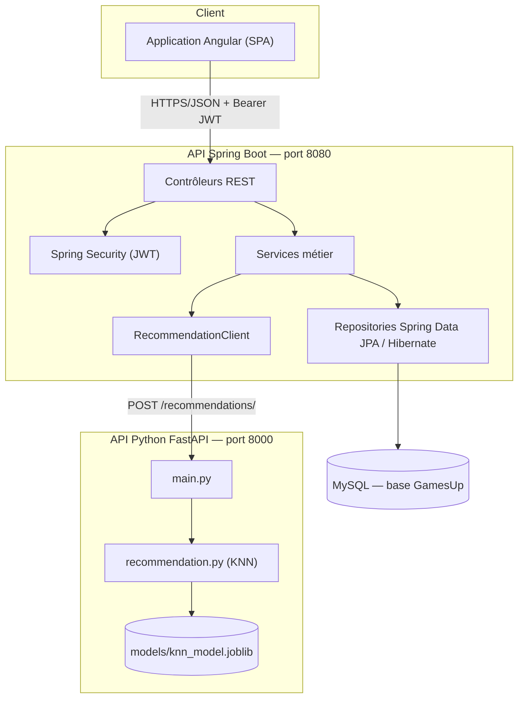
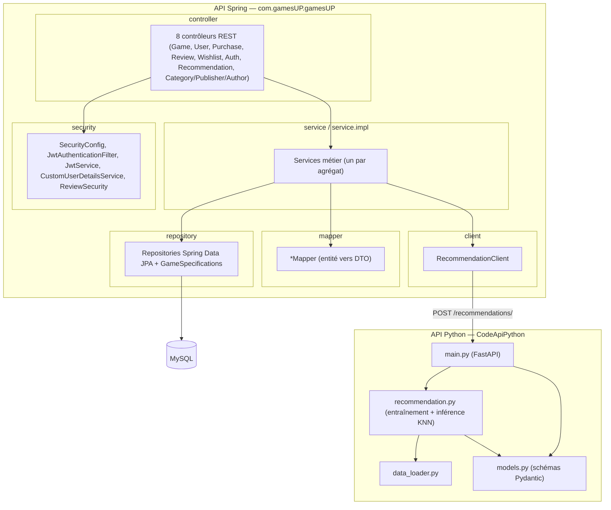
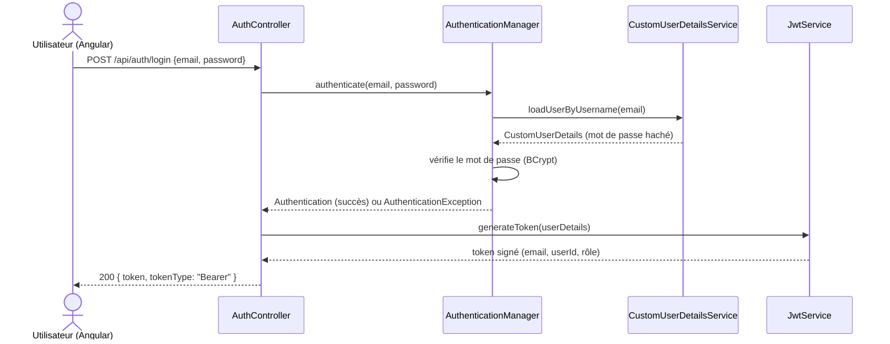
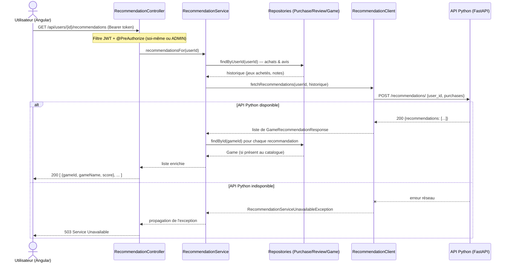

# Étape 5 — Documentation finale

Ce document rassemble ce qui était demandé pour clore l'étude de cas : les diagrammes UML, un point sur le respect des principes SOLID, le rapport de couverture de tests, un résumé du travail fait sur le système de recommandation, et un retour sur la façon dont le projet a été mené.

Pour aller plus loin sur un point précis, les documents détaillés de chaque étape restent la référence : analyse fonctionnelle dans `README.md` (étape 1), modèle de données dans `docs/02-modele-donnees.md`, architecture de l'API dans `docs/03-architecture-api.md`, sécurité et tests dans `docs/04-securite-tests.md`, système de recommandation dans `docs/05-systeme-recommandation.md`. Tout est dans le dépôt Git : **https://github.com/Sanbye/gamesup-etude-de-cas**, dossier `docs/`.

## Sommaire

1. [Diagramme d'architecture](#1-diagramme-darchitecture)
2. [Diagramme de classes](#2-diagramme-de-classes)
3. [Diagramme de composants](#3-diagramme-de-composants)
4. [Diagrammes de séquence](#4-diagrammes-de-séquence)
5. [Principes SOLID et bonnes pratiques](#5-principes-solid-et-bonnes-pratiques)
6. [Rapport de couverture de tests](#6-rapport-de-couverture-de-tests)
7. [Système de recommandation](#7-système-de-recommandation)
8. [Réflexion : bonnes et mauvaises pratiques du projet](#8-réflexion--bonnes-et-mauvaises-pratiques-du-projet)

---

## 1. Diagramme d'architecture

Trois briques qui ne communiquent qu'en HTTP/JSON : le front Angular (existant, on n'y touche pas dans cette étude de cas), l'API Spring qui porte le métier et la persistance, et l'API Python dédiée à la recommandation.

Quelques points qui valent la peine d'être soulignés : les trois briques tournent indépendamment les unes des autres, sans couplage fort — si l'API Python tombe, l'API Spring continue de répondre normalement, à l'exception logique de l'endpoint de recommandation qui renverra alors un 503. Côté authentification, tout est stateless via JWT, donc pas de session à répliquer si on scale l'API Spring horizontalement. Et l'API Python reste volontairement ignorante du schéma MySQL : elle ne reçoit que ce dont elle a besoin (des identifiants et des notes), transmis explicitement par Spring.

## 2. Diagramme de classes

Le modèle de données (entités JPA), issu de la démarche Merise détaillée dans `docs/02-modele-donnees.md`.

## 3. Diagramme de composants

## 4. Diagrammes de séquence

### 4.1 Authentification (login JWT)

### 4.2 Consultation des recommandations (flux complet Spring ↔ Python)

## 5. Principes SOLID et bonnes pratiques

Le détail est dans `docs/03-architecture-api.md` (section 2) ; voici l'essentiel.

| Principe | Application concrète |
|---|---|
| **S** — Single Responsibility | Un contrôleur ne fait que du mapping HTTP, un service porte la logique métier d'un agrégat, un mapper ne fait que convertir entité ↔ DTO. `GameSpecifications` isole à part la construction des critères de recherche |
| **O** — Open/Closed | `PasswordHasher` est une interface : on est passé d'une implémentation temporaire à `BCryptPasswordHasher` sans toucher à `UserService`. Même logique pour la recherche de jeux, où on ajoute des critères en combinant des `Specification<Game>` sans modifier le repository |
| **L** — Liskov Substitution | Les `*ServiceImpl` respectent strictement le contrat de leur interface, ce qui permet de les remplacer par des mocks dans les tests sans rien changer côté appelant |
| **I** — Interface Segregation | Une interface par agrégat (`GameService`, `UserService`, `RecommendationService`...) plutôt qu'une façade unique qui ferait tout |
| **D** — Dependency Inversion | Les contrôleurs dépendent des interfaces `service.*`, jamais des implémentations. `RecommendationService` dépend de `RecommendationClient`, pas de `RestClient` directement. Injection par constructeur partout |

Le reste des bonnes pratiques suivies : des DTOs (des records Java) systématiquement en entrée et sortie d'API, pour ne jamais exposer une entité JPA telle quelle (mot de passe compris) et garder le contrat d'API indépendant du schéma de base ; une gestion d'erreurs centralisée (`GlobalExceptionHandler`, `RestAuthenticationEntryPoint`, `RestAccessDeniedHandler`) qui fait que toute l'API répond avec le même format d'erreur, y compris pour l'authentification ; de la validation Bean Validation sur les DTOs de requête plutôt que des vérifications à la main éparpillées dans les contrôleurs ; des transactions posées au niveau service, jamais au niveau repository ou contrôleur ; et de l'autorisation déclarative via `@PreAuthorize` plutôt que des `if` de contrôle d'accès disséminés un peu partout.

## 6. Rapport de couverture de tests

Mesurée avec JaCoCo, reproductible en lançant `./mvnw clean test` puis en ouvrant `ANNEXES/gamesUP/target/site/jacoco/index.html` (le rapport HTML n'est pas versionné, il est régénéré à chaque run).

**81 tests, 0 échec** : 53 tests unitaires sur les 9 services (Mockito), 27 tests d'intégration avec `MockMvc` et une base H2 en mémoire (authentification, règles d'autorisation, flux métier de bout en bout), plus le test de chargement de contexte.

| Portée | Instructions | Lignes | Branches |
|---|---|---|---|
| **Globale** | **85,1 %** | **85,5 %** | 77,6 % |
| Objectif demandé | 70 % | — | — |

Détail par package :

| Package | Couverture (instructions) | Commentaire |
|---|---|---|
| `mapper`, `model`, `dto.*` (hors `dto.recommendation`) | 100 % | Classes simples (records, getters/setters), naturellement couvertes par les tests des couches supérieures |
| `dto.recommendation` | 83,3 % | Un accesseur de record non exercé directement ; même angle mort que `client` ci-dessous |
| `security.jwt` | 97,7 % | Génération/validation de token testée via les flux d'authentification |
| `security` | 95,2 % | Filtre JWT, `UserDetailsService`, `ReviewSecurity` exercés par les tests d'intégration |
| `service.impl` | 89,4 % | Couche métier, cœur de la couverture unitaire |
| `exception` | 77,5 % | Gestion d'erreurs, exercée par les cas d'erreur des tests d'intégration |
| `controller` | 52,6 % | Voir plus bas |
| `repository.spec` | 40,5 % | Voir plus bas |
| `client` | 0 % | Voir plus bas |
| `com.gamesUP.gamesUP` (racine) | 37,5 % | Classe `GamesUpApplication`, point d'entrée, peu de logique testable |

Trois zones méritent d'être signalées plutôt que cachées. `RecommendationClientImpl` n'est jamais exercé directement, parce qu'il est systématiquement simulé (`@MockBean`) dans les tests — logique puisqu'on ne teste pas l'API Python, mais ça laisse le code d'appel HTTP réel (sérialisation, gestion des erreurs réseau) sans filet automatisé. Du côté de `GameSpecifications`, deux ou trois critères de recherche (`hasAuthor`, `inStock`) ne sont pas exercés directement par un test, même si leur logique équivalente est déjà validée pour les critères principaux. Et les contrôleurs CRUD les plus simples (catégories, éditeurs, auteurs) ne sont testés en HTTP que sur la création, utilisée comme donnée de préparation dans d'autres tests — leurs mises à jour et suppressions ne sont vérifiées qu'au niveau service.

La couverture globale dépasse largement l'objectif de 70 %, mais autant rester transparent sur ce qui a été vérifié en profondeur et ce qui ne l'a été qu'indirectement (voir aussi la section 8).

## 7. Système de recommandation

Le détail complet est dans `docs/05-systeme-recommandation.md`. En résumé : il fallait une matrice utilisateur × jeu, une note de 1 à 5 par interaction, construite à partir des avis explicites quand ils existent, et sinon d'une note implicite par défaut pour les jeux achetés mais non notés.

L'algorithme est un KNN utilisateur-utilisateur (`sklearn.neighbors.NearestNeighbors`, similarité cosinus) côté API Python. La fonction d'entraînement (`train_model`, persistée via `joblib`) est indépendante et déjà fonctionnelle, même si aucune donnée réelle n'est encore disponible pour l'entraîner concrètement — en attendant, l'API retombe sur une liste de test, comme demandé dans l'énoncé.

Côté Spring, `RecommendationService` reconstruit l'historique de l'utilisateur et appelle l'API Python via `RecommendationClient` ; toute erreur réseau est traduite en 503, cohérent avec le reste de l'API. Les tests ne couvrent que la partie Spring, l'API Python n'étant volontairement pas testée (client HTTP simulé dans les tests d'intégration).

## 8. Réflexion : bonnes et mauvaises pratiques du projet

### Ce qui a bien fonctionné

Reprendre le modèle de données avant d'écrire la moindre ligne de contrôleur a sans doute été la décision la plus rentable du projet : la démarche Merise complète (MCD → MLD → JPA) a évité de construire des couches service/contrôleur sur des fondations bancales, qui était justement le problème principal du code laissé par le stagiaire.

Poser certaines abstractions un peu avant d'en avoir vraiment besoin, mais seulement quand le besoin futur était déjà certain, a aussi bien fonctionné. `PasswordHasher` a été introduit dès l'étape 2, avant même que Spring Security soit en place, pour ne pas avoir à réécrire `UserService` à l'étape 3. Ce n'est pas de l'anticipation gratuite : l'étape suivante était déjà connue au moment où le choix a été fait.

Tenir la documentation à jour à chaque étape plutôt que tout rédiger à la fin a payé aussi : ça évite d'oublier pourquoi telle décision a été prise, et ça permet de noter la justification pendant qu'elle est encore fraîche plutôt que de la reconstituer après coup.

Enfin, écrire les tests au fur et à mesure et suivre la couverture à chaque étape plutôt que de faire un audit final unique a permis de repérer tout de suite les régressions — la correction du modèle de Wishlist en est un bon exemple.

### Ce qui aurait pu être mieux fait

Il y a eu une vraie erreur de modélisation sur la Wishlist au départ : confusion entre « la liste » et « une ligne de la liste ». Elle n'a été repérée qu'après coup, une fois le code déjà écrit et testé. La corriger n'a pas posé de problème grâce aux tests déjà en place, mais elle aurait dû être vue dès le MCD, en se posant simplement la question « un utilisateur peut-il avoir plusieurs wishlists ? » plutôt qu'en la survolant.

Un défaut de configuration Maven est aussi passé inaperçu pendant deux étapes entières : Surefire n'incluait pas les classes `*IT` de façon fiable (ce rôle revient en principe à Failsafe, qu'on n'utilise pas ici), si bien qu'un même `mvn test` pouvait exécuter 58, 74 ou 81 tests selon les runs, sans qu'aucune erreur ne soit signalée. Ça veut dire que les chiffres de couverture annoncés aux étapes 2 et 3 n'étaient pas fiables a posteriori. Le défaut a été corrigé dès qu'il a été découvert, à l'étape 4, mais il aurait dû être repéré bien avant — une simple exécution répétée dès la première classe `*IT` écrite aurait suffi à le voir.

La couverture de tests n'est pas homogène partout : certains contrôleurs CRUD simples et certains critères de recherche ne sont testés qu'indirectement (détail en section 6). L'objectif global est dépassé, mais ça ne garantit pas que tout le code est vérifié au même niveau.

`RecommendationClientImpl` n'est jamais exercé par un vrai test : la consigne de ne pas tester l'API Python a été respectée, mais ça laisse un angle mort — un souci de sérialisation ou de configuration réseau entre les deux API ne serait détecté qu'à l'exécution manuelle, qu'il n'a pas été possible de faire dans cet environnement (Python n'y est pas installé).

Il n'y a pas de pagination sur les listes (`GET /api/games`, `/api/users`, `/api/purchases`...) : ça passe pour un jeu de données de démo, mais il faudrait corriger ça avant d'envisager un vrai catalogue en production.

Le rôle de l'utilisateur est figé dans le JWT au moment de la connexion, donc un changement de rôle via `PATCH /api/users/{id}/role` ne prend effet qu'à la reconnexion suivante. C'est un compromis assumé pour garder une architecture stateless simple, mais ça mériterait d'être documenté clairement côté front pour éviter les questions.

Et il n'y a pas de pipeline d'intégration continue : compilation, tests et couverture reposent entièrement sur une exécution manuelle en local — ce qui, soit dit en passant, aurait permis de repérer plus tôt le défaut de configuration Surefire mentionné plus haut.
